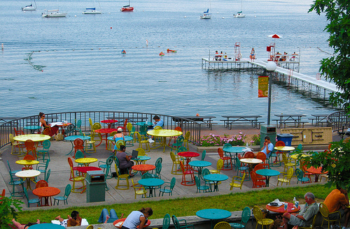
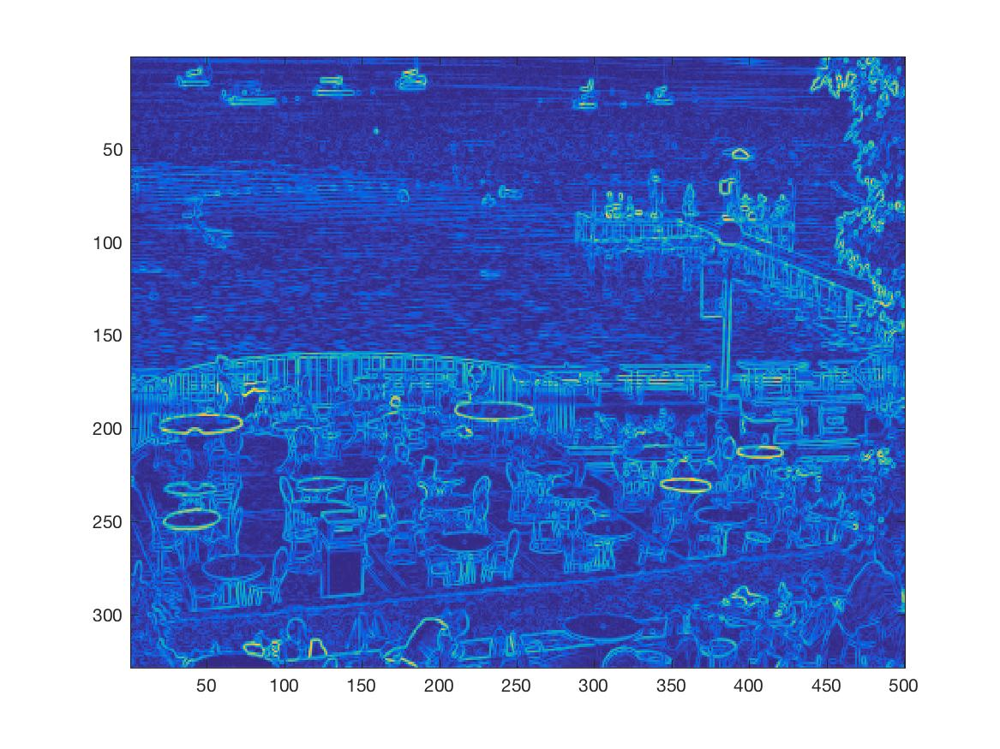
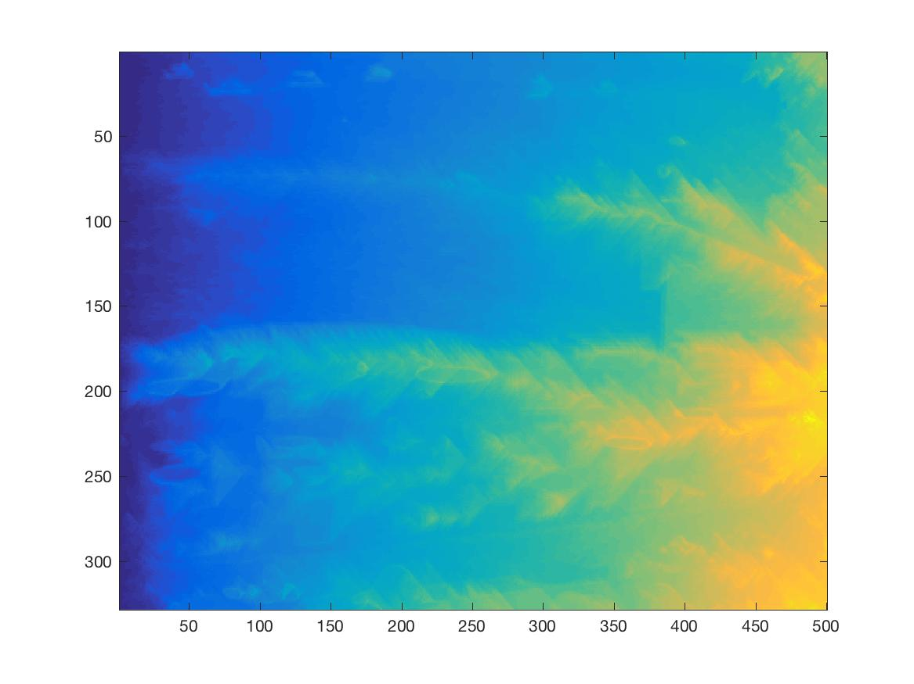
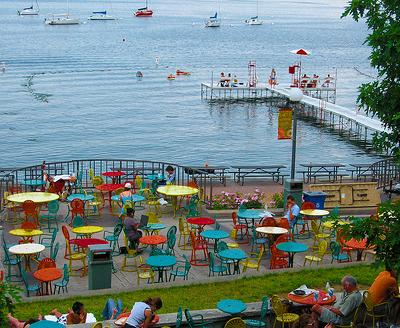
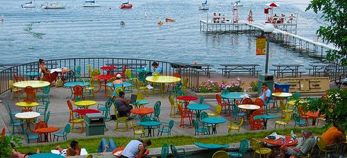
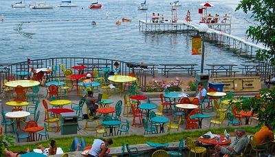

# Homework 3: Image Resizing Using Seam Carving
In this assignment an algorithm for resizing an image with minimal noticeable distortion is implimented using seam carving:
The following steps were taken with following [this](http://pages.cs.wisc.edu/~dyer/cs534/papers/AvidanShamir2007-SeamCarving.pdf) paper by Shai Avidan & Ariel Shamir.
    1. Computing the Energey function (imenergy.m)
    2. Computing the optimal horisontal seam (horizontal_seam.m)
    3. Removing the Seam (remove_horizontal_seam.m)
    4. Resize (shrnk.m)

### Results
#### Input Image: union-terrrace.jpg
This is the target image we want to resize.

#### Energy Function Output: 2a.jpg
Here we can see that edges where there is a sharp contrast in color, like the edge between the floor and a colorful table, have the highest energy.

#### cumulative minimum energy array: 2b.jpg
 
#### 100 Columns Removed: 1a.jpg

#### 100 Rows Removed: 1b.jpg

#### 100 Columns and 100 Rows removed: 1c.jpg

