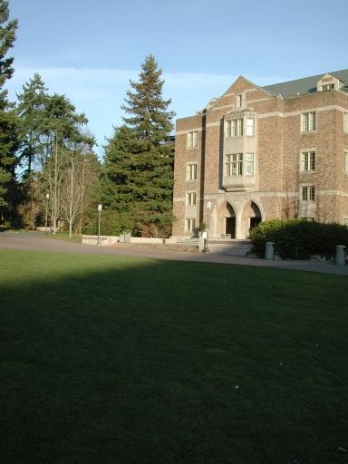
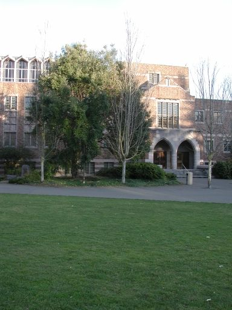

[Home Page](../README.md)
# Homework 4: Making Paronamas
Here a photo panorama stitcher is implemented that takes take four or more photographs and creates a panoramic image by 
computing homographies, warping, resampling, and blending the photos into a seamless output image. An open source library 
caled VLFeat is used to detect feature points and find their correspondences in overlapping pairs of images.

The methods and functions used here are outlined in [this](http://pages.cs.wisc.edu/~dyer/cs534/papers/szeliski96.pdf) paper by 
Richard Szeliski.

## Results
### Input Images: 1.jpg, 2.jpg, 3.jpg, 4.jpg

 

### Output Image: panorama.jpg

