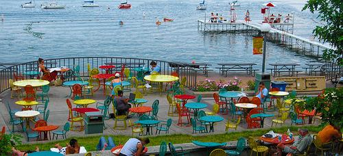

# Content:
This project consists of my submissions for the homework assignments outlined here: http://pages.cs.wisc.edu/~dyer/cs534/hw-toc.html. Homework number one is not included here because it is only for trying out software and no code was produced.

1. Homework 2: Image Processing in MATLAB
     * Problem 1: Histogram Equalization
     * Problem 2: Demosaicing
     * Problem 3: Color Transfer
  
2. Homework 3: Image Resizing using Seam Carving
3. Homework 4: Making Panoramas

# Homework 2: Image Processing in MATLAB
## Problem 1: Histogram Equalization
Here we use image histograms to enhance their contrast. We create our histogram manipulation matlab function myhisteq.m by following these steps:
1. Converting the input color image from RGB to HSV color space (using rgb2hsv which creates a double image), 
2. Computing the histogram and cumulative histogram of the V (luminance) image only, 
3. Transforming the intensity values in V to occupy the full range 0..255 in a new image W so that the histogram of W is roughly flat.
4. Combining the original H and S channels with the W image to create a new color image, which is then converted to an RGB color output image. 

### Results
#### Input: p1-bridge.jpg

#### Input: Bridge V Channel Histogram

#### Output: p1-bridge-out.jpg

#### Output: Bridge V Channel Histogram

#### Input: p1-snow.jpg

#### Input: Snow V Channel histogram

#### Output: p1-snow-out.jpg

#### Output: Snow V Channel Histogram

## Problem 2: Demosaicing
For digital cameras that have only one image sensor **Demosiacing** using **Bayer Patterns** is needed to convert the raw image into a full color image with three channels. In the **mydemosiac.m** matlab function, filters in the form of matrices with wieghted values are used to complete the process. After the process is complete and error image is created by computing at each pixel the squared difference between the raw image and the demosaiced image for each color channel separately, then adding the three matrices together to obtain the error image.

### Results
#### Raw Input: P2-crayons-raw.jpg

#### Demosiac Output:p2-crayons-demosaic.jpg

#### Error Image:p2-crayons-error.jpg

#### Raw Input: P2-union-raw.jpg

#### Demosiac Output:p2-union-demosaic.jpg

#### Error Image: p2-union-error.jpg

## Problem 3: Color Transfer
This is one of my favorite functions, here we use the colors of one (the target image) image to modify that of another image (the source image). This was accomplished using the same method from [this](http://pages.cs.wisc.edu/~dyer/cs534/papers/color-transfer-cga2001.pdf) paper by Erik Reinhard, Michael Ashikhmin, Bruce Gooch, and Peter Shirley.

### Results
#### Source: mysource.jpg

#### Target: mytarget.jpg

#### Output: myout.jpg

# Homework 3: Image Resizing Using Seam Carving
In this assignment an algorithm for resizing an image with minimal noticeable distortion is implimented using seam carving:
The following steps were taken with following [this](http://pages.cs.wisc.edu/~dyer/cs534/papers/AvidanShamir2007-SeamCarving.pdf) paper by Shai Avidan & Ariel Shamir.
    1. Computing the Energey function (imenergy.m)
    2. Computing the optimal horisontal seam (horizontal_seam.m)
    3. Removing the Seam (remove_horizontal_seam.m)
    4. Resize (shrnk.m)

### Results
#### Input Image: union-terrrace.jpg

#### Energy Function Output: 2a.jpg

#### cumulative minimum energy array: 2b.jpg
 
#### 100 Columns Removed: 1a.jpg

#### 100 Rows Removed: 1b.jpg

#### 100 Columns and 100 Rows removed: 1c.jpg

# Homework 4: Making Paronamas
Here a photo panorama stitcher is implemented that takes take four or more photographs and creates a panoramic image by computing homographies, warping, resampling, and blending the photos into a seamless output image. An open source library caled VLFeat is used to detect feature points and find their correspondences in overlapping pairs of images.

### Results
#### Input Images: 1.jpg, 2.jpg, 3.jpg, 4.jpg

 

#### Output Image: panorama.jpg

# Reference:
Although the solutions are mine please keep in mind that the course itself (http://pages.cs.wisc.edu/~dyer/cs534/index.html) does not belong to me. Also some of the steps described here are paraphrased from the homework assignments themselves which also do not belong to me.
